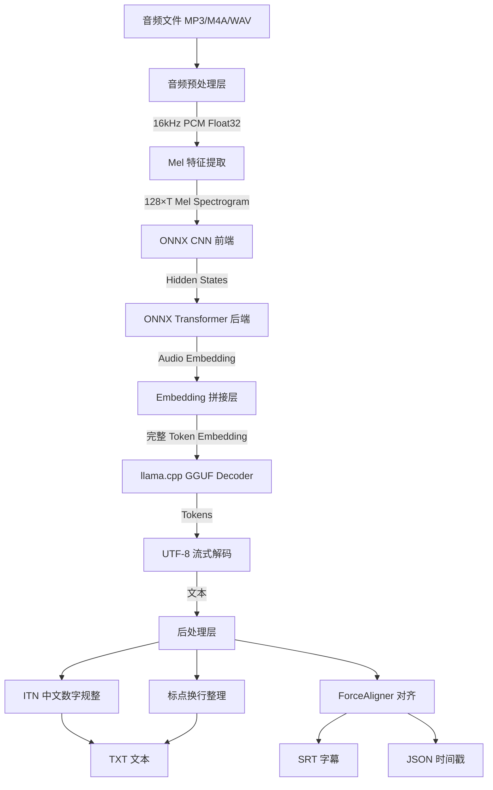

# Qwen3-ASR-GGUF 项目技术分析报告

> **作者**: AI 技术架构分析  
> **日期**: 2026年4月  
> **用途**: 学术论文参考资料  
> **项目地址**: https://github.com/HaujetZhao/Qwen3-ASR-GGUF  

---

## 摘要

Qwen3-ASR-GGUF 是一个将阿里巴巴 Qwen3-ASR 系列语音识别模型转换为混合 ONNX Encoder + GGUF Decoder 格式的工程实践项目，实现了"纯本地、高精度、低延迟"的离线语音识别。项目通过创新的编码器-解码器解耦设计，将音频特征提取委托给 ONNX Runtime 加速，将语言模型推理委托给 llama.cpp 的 GGUF 后端，同时集成 ForceAligner 实现字级时间戳对齐。本报告从技术架构、工程实践、性能表现、设计模式、生态定位等多个维度对该项目进行深度分析，旨在为端侧语音识别系统的工程化实现提供系统性的学术参考。

**关键词**: 语音识别；GGUF；模型量化；ONNX Runtime；llama.cpp；强制对齐；流式推理

---

## 目录

1. [项目概述](#1-项目概述)
2. [背景与动机](#2-背景与动机)
3. [核心设计理念](#3-核心设计理念)
4. [技术架构深度解析](#4-技术架构深度解析)
5. [功能体系](#5-功能体系)
6. [代码质量与工程实践](#6-代码质量与工程实践)
7. [设计模式分析](#7-设计模式分析)
8. [性能与可靠性](#8-性能与可靠性)
9. [安全性分析](#9-安全性分析)
10. [生态与社区](#10-生态与社区)
11. [竞品对比](#11-竞品对比)
12. [优缺点总结](#12-优缺点总结)
13. [学术借鉴方向](#13-学术借鉴方向)
14. [总体评价](#14-总体评价)

---

## 1. 项目概述

### 1.1 项目定位

Qwen3-ASR-GGUF 是一个面向端侧部署的语音识别推理引擎项目，其核心工作是将阿里巴巴通义千问团队发布的 Qwen3-ASR 系列模型（包括 0.6B 参数和 1.7B 参数两个规模等级）从原始的 PyTorch/SafeTensors 格式转换为混合推理格式：**音频编码器采用 ONNX 模型**，**文本解码器采用 GGUF 量化模型**。这一设计使其能够在消费级硬件上实现高效、准确的离线语音识别，无需云端网络连接。

### 1.2 核心特性

| 特性 | 说明 |
|------|------|
| **纯本地运行** | 所有推理均在本地完成，音频数据不外传 |
| **混合推理架构** | ONNX Runtime 负责编码器推理，llama.cpp 负责解码器推理 |
| **GPU 加速** | 编码器通过 DirectML 加速，解码器通过 Vulkan 加速 |
| **流式转录** | 支持无限时长音频的分段流式处理 |
| **字级时间戳** | 集成 Qwen3-ForcedAligner (0.6B)，输出 SRT/JSON 字幕 |
| **多语言支持** | 支持中、英、日、韩、粤语等 30+ 种语言 |
| **上下文增强** | 可注入领域提示词（Prompt）提升特定场景识别准确率 |
| **中文 ITN** | 内置中文数字规整模块，自动将中文数字转为阿拉伯数字 |

### 1.3 性能指标

在 RTX 5050 笔记本的实测环境下（50 秒中文音频，1.7B 模型），达到以下性能水平：

| 指标 | GPU 模式 | CPU 模式 |
|------|---------|---------|
| RTF（实时率） | **0.052** | 0.390 |
| 总处理耗时 | **2.59s** | 19.60s |
| 引擎初始化 | 3.61s | 2.75s |
| LLM 预填充速度 | **4149.1 tokens/s** | 162.1 tokens/s |
| LLM 生成速度 | **114.4 tokens/s** | 27.1 tokens/s |

RTF 为 0.052 意味着处理速度是实时音频播放速度的约 19 倍，远超实时性要求。

### 1.4 技术栈总结

```
核心依赖: onnxruntime-directml, llama.cpp (ctypes 绑定), numpy
音频处理: soundfile, ffmpeg (popen), 自研 Mel 滤波器
模型转换: PyTorch + torch.onnx, llama.cpp convert + quantize
CLI 工具: typer + rich
打包部署: PyInstaller
```

---

## 2. 背景与动机

### 2.1 端侧语音识别的产业趋势

近年来，随着大语言模型（LLM）技术的成熟，语音识别领域经历了从传统混合模型（DNN-HMM）到端到端序列模型的范式转变。以 Whisper、Paraformer、Qwen3-ASR 为代表的大规模预训练语音识别模型在准确率上取得了突破性进展。然而，这些模型通常需要昂贵的 GPU 服务器进行推理，限制了其在边缘设备和隐私敏感场景中的应用。

**端侧推理的核心矛盾**在于：模型性能（准确率）与推理效率（速度、资源占用）之间的权衡。项目 Qwen3-ASR-GGUF 正是为解决这一矛盾而设计——通过系统化的模型导出、量化和推理优化，将先进的大规模语音识别模型"压缩"到消费级硬件可运行的形态。

### 2.2 Qwen3-ASR 模型族

Qwen3-ASR 是阿里巴巴通义千问团队发布的基于 Qwen3 架构的语音识别模型，其核心设计特点包括：

- **Encoder-Decoder 架构**：编码器采用 Conformer 变体（CNN 前端 + Transformer 后端），解码器复用 Qwen3 语言模型的骨干网络
- **多尺度参数**：提供 0.6B 和 1.7B 两个规格，分别面向轻量级和高精度场景
- **多语言支持**：训练数据覆盖中文、英文及 30+ 语种
- **ForcedAligner 专项模型**：独立的 0.6B 参数模型，专门用于字级时间戳预测

官方推理方案依赖 HuggingFace Transformers 框架和 PyTorch 运行时，虽然功能完整但存在加载速度慢、内存占用高、依赖复杂等问题，不适合终端用户直接部署。

### 2.3 GGUF 格式的产业意义

GGUF（GGML Universal Format）是由 llama.cpp 社区定义的一种模型序列化格式，其设计哲学与 ONNX 互补：

| 维度 | ONNX | GGUF |
|------|------|------|
| 设计目标 | 神经网络计算图 | 大语言模型权重存储 |
| 核心优势 | 硬件加速器适配、图优化 | 量化友好、内存映射加载 |
| 典型后端 | ONNX Runtime | llama.cpp |
| 适用场景 | 卷积/Transformer 编码器 | 自回归文本解码 |

GGUF 格式的引入使得 LLM Decoder 部分可以享受 llama.cpp 社区多年积累的量化算法（Q4_K、Q8_0 等）、内存映射（mmap）快速加载和多后端加速（CUDA/Vulkan/Metal）红利。

### 2.4 项目的差异化动机

该项目并非简单的模型格式转换工具，其独特价值体现在以下几个方面：

1. **混合引擎设计**：不追求单一推理后端的"大一统"，而是根据 Encoder 和 Decoder 的计算特性分别为其选择最优运行时（ONNX 擅长 CNN/Transformer 的密集矩阵运算，llama.cpp 擅长自回归文本生成），是一种务实的异构计算实践。

2. **量化精度保留**：在 Encoder 端使用 int4 量化（与 fp16 输出的余弦相似度达 96%），在 Decoder 端使用 Q4_K 量化（相比 fp16 的困惑度仅增加 8.7%），在实际语音识别任务中，量化带来的精度差异小到可以忽略。

3. **全流程易用性**：从模型导出、量化到推理、输出格式转换（TXT/SRT/JSON），提供了"一条龙"的工具链，降低非技术用户的使用门槛。

4. **Windows 生态友好**：充分利用 DirectML（Windows 原生 GPU 加速 API），无需 CUDA 环境即可获得 GPU 加速，特别适合 Windows 桌面用户和笔记本用户。

---

## 3. 核心设计理念

### 3.1 编码器-解码器解耦设计

Qwen3-ASR 模型本身是一个 Encoder-Decoder 架构：编码器负责将音频信号压缩为高维特征序列，解码器（即 LLM）负责将特征序列转换为文本。项目深刻理解这一架构特性，做出了"编码器和解码器分轨导出"的关键设计决策：

- **Encoder → ONNX**：音频编码器（CNN + Transformer）的计算模式是典型的单次前向传播，没有自回归依赖。ONNX Runtime 对这种计算图有成熟的优化策略（算子融合、常量折叠、内存规划），且 DirectML 后端在 Windows 上提供零配置的 GPU 加速。

- **Decoder → GGUF**：文本解码器（Qwen3 LLM）的计算模式是自回归生成，需要维护 KV Cache，涉及复杂的采样策略和上下文管理。llama.cpp 在这一领域有深厚的积累，其 GGUF 格式对量化权重的支持也远优于 ONNX 的量化方案。

这种"人尽其才、物尽其用"的设计理念是该项目在工程上的最大亮点。

### 3.2 同步执行简化策略

项目早期版本采用多进程异步流水线架构，试图通过流水线并行隐藏编码器和解码器的延迟。但随着 DirectML 加速后 Encoder 的速度提升至极高水平（30 秒音频仅需约 0.04 秒编码），复杂的多进程管理带来的代码复杂度和调试难度已超过其性能收益。因此项目做出了"去异步、归同步"的简化决策：

```
编码 -> LLM 推理 -> 对齐
```

同步顺序执行使代码结构清晰、可调试性强，而 RTF 依然保持在领先水平。这一决策体现了"简单优于复杂"的工程哲学，值得在类似系统中借鉴。

### 3.3 DML 固定形状 Padding 优化

DirectML 在处理动态形状的 ONNX 图时会频繁分配和释放 GPU 显存，导致严重的性能抖动。项目的应对策略是：**在推理时将音频填充（Padding）到固定时间长度（如 40 秒），配合 Attention Mask 屏蔽填充区域**。

具体实现体现在 `QwenAudioEncoder._run_backend()` 方法中：

1. 预计算目标帧数 `h_target_len = dml_pad_to * 13`（1 秒对应 13 帧 hidden_states）
2. 若实际帧数不足，对 hidden_states 进行零填充
3. 构造 Attention Mask：有效帧对应 0（关注），填充帧对应 -10000.0（屏蔽）
4. 推理完成后截断输出至实际帧数

这一"以空间换稳定"的策略虽然增加了少量无效计算，但避免了 DML 后端频繁分配显存导致的性能断崖式下跌，最终总耗时反而更短。

### 3.4 编码器拆分：前端 CNN + 后端 Transformer

将编码器进一步拆分为前端和后端两个独立的 ONNX 模型，是本项目另一精巧设计：

- **前端（Atomic Frontend）**：以 100 帧（1 秒）为单位的 CNN 静态 ONNX 模型。每 100 帧的 Mel 特征独立通过 CNN 处理，通过循环拼接结果。这种原子化设计使得前端模型形状完全静态，ONNX 可以充分进行图优化。

- **后端（Transformer Backend）**：处理由前端拼接的 hidden_states 序列，通过自注意力机制捕获全局上下文。支持动态时间轴或固定形状 Padding 两种模式。

这一拆分解决了音频长度可变性与 ONNX 静态图优化之间的矛盾：固定形状的前端可以充分优化，动态长度的后端则通过 Padding 策略转静态。

---

## 4. 技术架构深度解析

### 4.1 总体架构

项目的推理流水线可分为四个层次，如下图所示：



### 4.2 音频预处理层

音频预处理层负责将各种格式的音频文件转换为模型可处理的标准格式。核心实现位于 `qwen_asr_gguf/inference/audio.py`，采用双路径策略：

**路径 A — soundfile 直读**（支持 .wav/.flac/.ogg/.mp3）：
- 使用 `soundfile` 库直接读取音频数据
- 多声道转单声道（取均值）
- 纯 NumPy 实现的 `resample_poly` 完成重采样（与 scipy 相似度 0.99999998）

**路径 B — ffmpeg 管道**（支持 .m4a/.mp4/.opus 等）：
- 通过 `subprocess.Popen` 调用 ffmpeg 解码
- 目标格式：16kHz 采样率、单声道、32 位浮点 PCM
- 通过 stdin pipe 直接读取，零磁盘 I/O

`numpy_resample_poly` 是值得关注的纯 NumPy 重采样实现。它精准复刻了 `scipy.signal.resample_poly` 的数学逻辑——包括 Kaiser 窗 FIR 滤波器设计和多相滤波结构——避免了引入 scipy 这一重依赖。在 16000Hz 到 24000Hz 的重采样中，与 scipy 输出的余弦相似度达 0.99999998，充分体现了"精准复刻，无依赖引入"的工程思路。

### 4.3 Mel 特征提取层

Mel 特征提取由 `FastWhisperMel` 类实现（位于 `encoder.py`），严格复刻 Whisper/Qwen3 的 Mel 滤波器组逻辑：

1. **反射 Padding**：与 librosa 的 `center=True` 行为一致
2. **高效分帧**：利用 NumPy `as_strided` 零拷贝视图，避免内存分配
3. **实数 FFT**：`np.fft.rfft` 加汉明窗
4. **能量谱 → Mel 映射 → 对数压缩 → 归一化**
5. **帧对齐**：丢弃尾部多余帧，与降采样比例匹配

值得注意的是，该类支持两种 Mel 尺度：
- **Slaney Scale**（分段线性+对数变换）：Whisper 默认，与人类听觉更匹配
- **HTK Scale**（纯对数变换）：传统 HMM 系统的标准

滤波器组支持从 `.npy` 文件加载预计算权重，也可在运行时动态生成。

### 4.4 ONNX 编码器层

`QwenAudioEncoder` 类封装了编码器的完整推理流程，是混合架构的核心桥梁：

```python
def encode(self, audio: np.ndarray) -> tuple:
    # 1. Mel 特征提取 (128 × T)
    mel = self.mel_extractor(audio, dtype=self.input_dtype)
    # 2. CNN 前端循环推理
    hidden_states = self._run_frontend(mel)
    # 3. Transformer 后端推理 (固定形状 Padding + Attention Mask)
    audio_embd = self._run_backend(hidden_states)
    # 4. 去除 Batch 维
    return audio_embd[0], elapsed
```

**ONNX Session 管理**的关键细节：

- `graph_optimization_level = ORT_ENABLE_ALL`：启用所有图优化
- `session.intra_op.allow_spinning = "0"`：禁用 CPU 自旋等待（减少 DML 干扰）
- 动态精度检测：根据 ONNX 模型输入类型自动选择 `np.float16` 或 `np.float32`
- **预热机制**：初始化后立即用零音频执行一次完整编码，触发 DML 的资源预分配和 shader 编译缓存

**多 Provider 支持**通过优先级列表实现：`[DmlExecutionProvider, CUDAExecutionProvider, TensorrtExecutionProvider, CPUExecutionProvider]`，自动fallback，零配置切换。

### 4.5 GGUF Decoder 与 llama.cpp 绑定

`qwen_asr_gguf/inference/llama.py` 是整个项目中最具技术深度的模块之一。它通过 **Python ctypes** 实现了对 llama.cpp 原生 C API 的完整绑定，包含约 400 行类型定义和函数签名映射。

**绑定覆盖范围**：

| 类别 | 函数 | 用途 |
|------|------|------|
| 初始化 | `llama_backend_init`, `ggml_backend_load_all` | 加载 GPU 后端 (CUDA/Vulkan/Metal) |
| 模型 | `llama_model_load_from_file`, `llama_model_free` | GGUF 模型生命周期 |
| 上下文 | `llama_init_from_model`, `llama_free` | 推理上下文管理 |
| 批处理 | `llama_batch_init`, `llama_batch_free`, `llama_decode` | 批量 Token 推理 |
| 词表 | `llama_tokenize`, `llama_token_to_piece` | 文本↔Token 转换 |
| 采样 | `llama_sampler_chain_init`, `llama_sampler_sample` | 采样链（温度/TopK/TopP/MinP） |
| 内存 | `llama_get_memory`, `llama_memory_clear` | KV Cache 管理 |

**面向对象封装**将原生 C 指针包装为 Python 类：

- `LlamaModel`：模型加载、分词/反分词、Token Embedding 访问
- `LlamaContext`：KV Cache 管理、单 Token 和前向解码
- `LlamaBatch`：批量 Embedding 注入，支持自定义 Position ID（Qwen3 多平面位置编码）
- `LlamaSampler`：链式采样器，支持 Logit Bias、惩罚项、白名单/黑名单过滤

**超极速 Embedding Table 提取**（`get_token_embeddings_gguf` 函数）是本模块的另一技术亮点。传统方案需要完整加载 GGUF 模型才能获取 Token Embedding，而该函数通过直接二进制寻址 GGUF 文件（`np.memmap`），跳过 15 万词条的 tokenizer 对象解析，在 **< 50ms** 内完成提取。具体流程：

1. 解析 GGUF 文件头获取 tensor_count 和 alignment
2. 扫描 KV 元数据区定位 `general.alignment` 字段
3. 扫描 Tensor Info 区查找 `token_embd.weight` 的偏移量和量化类型
4. 使用 `memmap` 加载原始字节并构造 `LlamaEmbeddingTable` 视图（支持按需反量化）

### 4.6 ASR 核心引擎

`QwenASREngine` 类（位于 `asr.py`）是项目的主控引擎，编排了整个转录流水线。

**Embedding 拼接机制**是该引擎的核心创新点。Qwen3-ASR 的 LLM Decoder 需要接收包含音频、系统提示、指令和历史的完整序列。`_build_prompt_embd` 方法将这一复杂需求实现为简洁的三段式拼接：

```
[Prefix Tokens] [Audio Embedding] [Suffix Tokens]
  System +      ONNX Encoder      指令 + 语言 +
  User Header     输出          历史 + 响应头
```

具体实现为：
- Prefix: `<|im_start|>system\n{context}<|im_end|><|im_start|>user\n<|audio_start|>`
- Audio: ONNX 编码器的输出 Embedding（动态序列长度）
- Suffix: `<|audio_end|><|im_end|><|im_start|>assistant\nlanguage {lang}<asr_text>{history}`

这三部分分别通过 Token Embedding Table 查表和直接注入 Audio Embedding 来填充最终的 Embedding 矩阵，然后一次性送入 llama.cpp 进行 Prefill。

**流式分段处理**采用记忆机制实现跨片段上下文传递：

```python
asr_memory = deque(maxlen=memory_chunks)  # 存储 (embd, text)

for i in range(num_chunks):
    # 1. 编码当前片段
    audio_feature = encoder.encode(chunk_data)
    # 2. 拼接历史记忆与当前片段
    combined_audio = concat([memory_embd...], audio_feature)
    prefix_text = concat([memory_text...])
    # 3. LLM 解码（含历史上下文）
    res = decode(combined_audio, prefix_text)
    # 4. 更新记忆
    asr_memory.append((audio_feature, res.text))
```

`memory_chunks` 参数控制保留多少历史片段的 Embedding，这在处理长音频时尤为重要——它提供了跨片段的语义连贯性，类似于 NLP 中的短期记忆机制。

**带熔断的加温重试**（`_safe_decode` 方法）是保障推理稳定性的关键设计。当检测到输出陷入重复循环（最近 15 个 token 中不同值 <= 3）时，自动提高采样温度（+0.3）并重试，最多重试 4 次。这是一种工程化的"软失败"策略：不直接丢弃结果，而是通过调整超参数尝试恢复。

### 4.7 ForcedAligner 对齐层

`QwenForcedAligner`（位于 `aligner.py`）实现了基于 Qwen3-ForcedAligner 模型的字级时间戳预测。

**核心推理范式**：与 ASR 不同，Aligner 不生成文本，而是在给定文本和音频的条件下，预测每个词/字的起止时间戳。其 Prompt 结构为：

```
<audio_start> [Audio Embedding] <audio_end> <word1> <timestamp> <timestamp> <word2> ...
```

每个 `<timestamp>` token 的输出 logits 代表一个 80ms 步长的时间戳位置。通过解析这些 logits（取 argmax 在 [0, 4000) 范围内，对应最大 320 秒音频），即可获得每个词的起止时间。

**AlignerProcessor** 提供了多语言分词和时间戳修正能力：

- **中文**：按 CJK 字符逐字拆分（Unicode 范围覆盖基本汉字到扩展 F 区）
- **日文**：通过 `nagisa` 库进行形态素分析分词
- **韩文**：通过 `soynlp` 的 L-Tokenizer 进行分词，使用预置的韩文词典（jieba 格式）
- **其他语言**：按空格切分，同时对 CJK 字符进行逐字处理（支持中英混排）

**fix_timestamps** 方法实现了基于 LIS（最长递增子序列）的时间戳异常修正。由于模型预测的时间戳序列可能存在局部乱序或噪声，该算法首先找出 LIS 中的"正常点"，然后对异常区间进行插值修正——短异常区间（≤2 个点）用邻近值填充，长异常区间用线性插值。

**reconcile** 方法将干净的对齐项与原始文本（含标点符号）重新整合。标点符号被赋予前一个字的时间戳覆盖范围，确保输出的 SRT 字幕包含完整标点。

### 4.8 后处理层

**中文 ITN（Inverse Text Normalization）** 由 `chinese_itn.py` 实现，通过正则表达式驱动，将语音识别输出的中文数字转换为阿拉伯数字。支持的转换类型包括：

| 类型 | 示例输入 | 示例输出 |
|------|---------|---------|
| 纯数字 | 幺九二点幺六八点幺点幺 | 192.168.1.1 |
| 数值 | 三百五十万人 | 350万人 |
| 范围 | 三五百人 | 300~500人 |
| 分数 | 三分之二 | 2/3 |
| 百分数 | 百分之二十五 | 25% |
| 比值 | 三比二 | 3:2 |
| 时间 | 三点二十五分 | 3:25 |
| 日期 | 二零二五年十月 | 2025年10月 |

ITN 模块设计了详细的优先级匹配链：成语/习语黑名单 → 模糊表达（含"几"）→ 范围表达式 → 时间 → 纯数字 → 连续数值 → 数值 → 百分数 → 分数 → 比值 → 日期。这一优先级设计避免了"正经八百"被转换为"正800"、"一点一滴"被转换为"1.1滴"等误伤。

**输出格式化**（`exporters.py`）处理三种导出格式：
- TXT：应用 ITN + 标点换行整理
- SRT：根据中英文标点自然分割为字幕条目，每行不超过 40 字符
- JSON：输出字/词级别的时间戳数组

---

## 5. 功能体系

### 5.1 语音转录

核心功能，支持从命令行（`transcribe.py`）或 Python API 调用。提供丰富的参数配置：
- **模型配置**：模型路径、编码精度（fp32/fp16/int8/int4）、ONNX Provider、GPU 开关
- **转录设置**：语言指定、上下文提示词、采样温度
- **音频切片**：起始位置、处理时长
- **流式配置**：分段大小（默认 40 秒）、记忆片段数

### 5.2 流式处理

通过分段（Chunk）策略实现无限时长音频的处理。每个 Chunk 默认 40 秒，通过记忆机制（`memory_num` 参数）保持跨片段语义连贯。这种"伪流式"方案在保持实现简洁性的同时，达到了实际上的流式效果。

### 5.3 字级时间戳对齐

通过独立的 ForcedAligner 模型（0.6B 参数）实现字/词级别的精确时间戳预测。对齐结果可用于：
- SRT 格式字幕文件生成
- JSON 格式时间戳数据导出
- 音视频后期处理的精确定位

### 5.4 多语言支持

支持 30 种语言的语音识别和强制对齐：

```
中文、英语、粤语、日语、韩语、阿拉伯语、德语、法语、西班牙语、
葡萄牙语、印尼语、意大利语、俄语、泰语、越南语、土耳其语、印地语、
马来语、荷兰语、瑞典语、丹麦语、芬兰语、波兰语、捷克语、菲律宾语、
波斯语、希腊语、罗马尼亚语、匈牙利语、马其顿语
```

语言名称容忍大小写变体（`normalize_language_name` 归一化），支持自动语言检测（不指定时由模型自动判断）。

### 5.5 上下文增强

通过 `context` 参数注入对话系统提示词（System Prompt），可以显著提升特定场景下的识别准确率。例如：

```python
context = "这是1004期睡前消息，主持人叫督工，助理叫静静。"
```

上下文信息被注入到 LLM 的 System Prompt 中，使得解码器可以更好地利用语言模型的先验知识来消除语音歧义。

### 5.6 模型导出工具链

项目提供了一套完整的模型格式转换流水线（编号脚本 00-17）：

**ASR 模型导出流程**：
1. `00-Export-Mel-Filters.py` - 导出 Mel 滤波器组权重
2. `01-Export-ASR-Encoder-Frontend.py` - PyTorch → ONNX（CNN 前端，固定 100 帧）
3. `02-Export_ASR-Encoder-Backend.py` - PyTorch → ONNX（Transformer 后端，动态时间轴）
4. `03-Optimize-ASR-Encoder.py` - ONNX 图优化（融合常量、折叠算子）
5. `04-Quantize-ASR-Encoder.py` - ONNX 量化（FP16/INT8/INT4）
6. `05-Export-ASR-Decoder-HF.py` - 提取 LLM 权重为 SafeTensors
7. `06-Convert-ASR-Decoder-GGUF.py` - SafeTensors → GGUF（通过 Monkey Patch 适配 Qwen3-VL 架构）
8. `07-Quantize-ASR-Decoder-GGUF.py` - GGUF 量化（Q4_K）

**Aligner 模型导出流程**（脚本 11-17）：结构对称，针对 ForcedAligner 模型。

---

## 6. 代码质量与工程实践

### 6.1 模块化设计

项目代码按职责清晰分层：

```
qwen_asr_gguf/
├── __init__.py          # 日志系统初始化
├── inference/
│   ├── __init__.py      # 公共 API 导出
│   ├── asr.py           # ASR 核心引擎（340 行）
│   ├── encoder.py       # ONNX 编码器封装（264 行）
│   ├── llama.py         # llama.cpp ctypes 绑定（974 行）
│   ├── aligner.py       # ForceAligner 推理（350 行）
│   ├── audio.py         # 音频加载与重采样（149 行）
│   ├── schema.py        # 数据类定义（115 行）
│   ├── exporters.py     # 结果导出格式化（120 行）
│   ├── chinese_itn.py   # 中文数字规整（520 行）
│   └── utils.py         # 语言工具函数（57 行）
└── bin/                 # llama.cpp 预编译二进制
```

每个模块职责单一、内聚性高，模块间通过明确的接口（dataclass）通信，依赖关系清晰。

### 6.2 类型注解与数据类

所有配置和传输对象均使用 `@dataclass` 定义（`schema.py`），提供了运行时不可变性（`frozen=True`）和默认值支持。例如：

- `ASREngineConfig`：ASR 引擎配置，含自动关联 Aligner 配置的 `__post_init__`
- `AlignerConfig`：对齐器配置
- `DecodeResult`：LLM 解码结果标准化
- `ForcedAlignItem`：单个词/字符的不可变对齐项
- `TranscribeResult`：转录结果聚合

数据类的使用带来了配置校验、IDE 自动补全和序列化便利。

### 6.3 日志系统

`__init__.py` 中实现的日志系统设计周全：
- 支持文件日志和自定义级别
- 自动创建日志目录
- 兼容 PyInstaller 打包环境（通过 `sys.frozen` 判断）
- llama.cpp 的 C 日志通过回调函数桥接到 Python logging

### 6.4 错误处理与容错

- **模型文件完整性检查**：`check_model_files` 在推理前验证所需文件，给出清晰的错误提示和下载指引
- **引擎初始化失败处理**：捕获异常后提供分类的解决方案建议（切换 Provider、禁用 Vulkan、提交 Issue）
- **音频解码降级**：soundfile 失败时自动 fallback 到 ffmpeg
- **分词器降级**：日文 nagisa/韩文 soynlp 不可用时退化为逐字处理
- **对齐 token 匹配失败**：无法在原文本中找到 token 时的降级处理，保持原项

### 6.5 PyInstaller 打包适配

`build.spec` 和 `build_hook.py` 实现了对 PyInstaller 打包的完整支持：
- **私有模块排除**：`qwen_asr_gguf` 不作为编译后的 .pyc 打包，而是以源文件形式保留（通过提取 pure 列表并过滤）
- **第三方依赖分离**：第三方库放入 `internal/` 子目录（`contents_directory`）
- **目录连接符**：模型文件夹通过 Windows `mklink /j` 创建 junction，避免复制大文件
- **运行时路径**：`build_hook.py` 确保执行文件目录和 internal 目录都在 sys.path 中

### 6.6 测试体系

`test_inference.py` 实现了系统化的集成测试，覆盖：
- **模型规模**：0.6B / 1.7B
- **语言**：中文 / 英文
- **加速模式**：GPU（DML + Vulkan）/ 纯 CPU
- **对齐功能**：启用 / 不启用 ForceAligner

共计 8 个测试用例的排列组合，结果自动汇总为表格并保存 JSON 报告。此外还有 `test_dml_speed.py`、`test_profile.py`、`test_quant_accuracy.py`、`test_vram.py` 等专项测试。

---

## 7. 设计模式分析

### 7.1 策略模式 — ONNX Provider 选择

`QwenAudioEncoder.__init__` 中的 Provider 选择逻辑是策略模式的典型应用。根据 `onnx_provider` 参数的不同值（CPU/DML/CUDA/TensorRT），选择不同的执行策略：

```python
if provider == 'DML' and 'DmlExecutionProvider' in available:
    providers.insert(0, 'DmlExecutionProvider')
elif provider == 'CUDA' and 'CUDAExecutionProvider' in available:
    providers.insert(0, 'CUDAExecutionProvider')
elif provider in ('TRT', 'TENSORRT') and ...:
    providers.insert(0, ('TensorrtExecutionProvider', {...}))
```

同时，Backend 推理方法（`_run_backend`）根据 `self.active_dml` 标志动态切换 Padding 策略，体现了不同策略下算法的差异化实现。

### 7.2 模板方法 — ASR 流水线

`QwenASREngine.asr()` 方法定义了转录流水线的骨架算法：

```
for each chunk:
    1. encode(chunk)             → 可被子类覆盖
    2. build_prompt(embedding)   → 可被子类覆盖  
    3. decode(prompt)            → 可被子类覆盖
    4. align(text, audio)        → 可选步骤
```

虽然当前 Python 实现未使用抽象基类，但该流水线的结构天然适合模板方法模式，为未来扩展（如不同的 Encoder/Decoder 组合）提供了清晰的接口边界。

### 7.3 外观模式 — QwenASREngine

`QwenASREngine` 作为整个系统的统一入口，封装了编码器、解码器、对齐器三个子系统的复杂性。用户仅需：

```python
engine = QwenASREngine(config)
result = engine.transcribe(audio_file, language="Chinese")
engine.shutdown()
```

内部的初始化顺序、内存分配、资源协调和异常处理对调用方透明。

### 7.4 适配器模式 — llama.cpp ctypes 绑定

`llama.py` 中的全局函数指针绑定是适配器模式的系统级应用。它将 llama.cpp 的 C API 封装为 Python 可调用的接口，通过 ctypes 完成类型转换和内存管理。`LlamaModel`、`LlamaContext`、`LlamaBatch`、`LlamaSampler` 四个类在适配器之上提供了面向对象的抽象层。

### 7.5 责任链模式 — Sampler 链

`LlamaSampler.__init__` 中构建的采样链是责任链模式的实现：

```
Logit Bias → Penalties → Top-K → Top-P → Min-P → Temperature → Distribution
                                                        ↓ (temperature == 0)
                                                     Greedy
```

每个采样器依次处理 logits，最终的 `llama_sampler_sample` 遍历整条链产生采样结果。

---

## 8. 性能与可靠性

### 8.1 性能指标深度分析

**GPU 模式（DML + Vulkan）** 的核心性能指标：

| 阶段 | 耗时 | 速度指标 | 说明 |
|------|------|---------|------|
| Encoder 推理 | ~0.21s | — | ONNX DirectML 加速，固定形状优化 |
| LLM Prefill | 0.420s | 4149.1 tok/s | 包含 1742 个 token 的 Embedding 序列 |
| LLM Generation | 1.670s | 114.4 tok/s | 生成 191 个输出 token |
| Aligner 对齐 | ~0.83s | — | 分段异步对齐 |

总处理耗时 2.59 秒完成 50.2 秒的音频处理，意味着系统有充裕的时间余量处理更长的音频或运行额外的后处理。

**RTF（Real-Time Factor）** 是语音识别系统最核心的性能指标。该项目的 RTF 为 0.052，意味着处理 1 秒音频仅需 0.052 秒计算机时间，约为 19 倍实时速度。对于实时对话系统，RTF < 0.3 即视为可接受，RTF < 0.1 视为优秀，0.052 属于顶级水平。

**CPU 模式** 下 RTF 为 0.390，仍能满足实时处理需求（< 1.0），体现了 llama.cpp 在纯 CPU 环境下的优化能力（如 BLAS 加速、内存映射）。

### 8.2 显存占用分析

| 组件 | DML 显存 | Vulkan 显存 | 说明 |
|------|---------|------------|------|
| ASR Encoder (1.7B) | 473 MB | — | int4 量化 ONNX |
| Aligner Encoder (0.6B) | 420 MB | — | int4 量化 ONNX |
| **DML 小计** | **~900 MB** | — | — |
| ASR Decoder (1.7B) | — | 1064 MB | Q4_K 量化模型 |
| Decoder 上下文 | — | 228 MB | KV Cache |
| Decoder 推理 | — | 304 MB | 运行时 |
| Aligner Decoder (0.6B) | — | 372 MB | Q4_K 量化模型 |
| **Vulkan 小计** | — | **~2.5 GB** | — |

总显存需求约 3.4 GB，RTX 5050 笔记本（通常配置 8 GB VRAM）完全能容纳，留有充足余量。

### 8.3 量化精度分析

- **Encoder int4 量化**：与 fp16 输出的**余弦相似度 96%**。对于音频特征提取，这一相似度意味着编码器输出在实际语音识别中引起的精度差异几乎不可察觉。
- **Decoder Q4_K 量化**：相比 fp16 输出的**困惑度仅增加 8.7%**。在自回归文本生成中，困惑度的微小增加通常不会改变最终的识别文本。

### 8.4 可靠性机制

**熔断加温重试** 是 `_safe_decode` 中设计的核心可靠性保障：当检测到 token 重复循环时自动提高温度重试，最多 4 次。这避免了模型陷入无限重复输出的最坏情况。

**资源自动释放**：所有 llama.cpp 资源类（`LlamaModel`、`LlamaContext`、`LlamaBatch`、`LlamaSampler`）均在 `__del__` 中调用对应的 `free` 函数，确保即使在异常路径下也不会发生显存泄漏。

---

## 9. 安全性分析

### 9.1 数据隐私

项目的**纯本地运行**特性是其最大的安全优势。所有音频数据和识别结果均在本地处理，无需上传到云端。在医疗记录转写、法律会议记录、企业内部沟通等隐私敏感场景中，这一特性具有不可替代的价值。

### 9.2 输入安全性

- **文件路径安全**：使用 `pathlib.Path` 进行路径操作，避免字符串拼接导致的路径遍历漏洞
- **ffmpeg 管道安全**：通过 subprocess 调用，不涉及 shell 注入（使用列表参数而非字符串命令）
- **语言参数校验**：`validate_language` 函数对语言名称进行白名单校验，拒绝未支持的语言

### 9.3 异常安全

- **ffmpeg 进程管理**：`load_audio_ffmpeg` 使用 `process.communicate()` 确保 stdin/stdout/stderr 正确关闭
- **资源清理**：`transcribe.py` 使用 `try-finally` 确保引擎的 `shutdown()` 一定被调用
- **ONNX Session 预热**：初始化阶段的预热推理可以在正式任务前暴露 GPU 兼容性问题

### 9.4 潜在风险

- **DLL 加载安全**：`llama.py` 通过 `ctypes.CDLL` 加载本地二进制文件，如果 `qwen_asr_gguf/bin/` 目录中的 DLL 被恶意替换，可能导致任意代码执行。建议用户从官方 llama.cpp Releases 下载，并校验 SHA256。
- **GGUF 文件信任**：GGUF 格式的文件头解析（`get_token_embeddings_gguf`）未做完整性校验，理论上畸形文件可能导致读取越界。不过 `np.memmap` 的只读模式限制了写破坏。

---

## 10. 生态与社区

### 10.1 与 llama.cpp 生态的关系

Qwen3-ASR-GGUF 深度依赖 llama.cpp 生态：

- **模型转换**：复用了 llama.cpp 的 `convert_hf_to_gguf.py` 脚本（通过 Monkey Patch 适配 Qwen3-VL 架构）
- **量化工具**：使用 llama.cpp 的 `llama-quantize` 命令行工具进行 GGUF 量化
- **推理运行时**：通过 ctypes 绑定调用 llama.cpp 的 C API
- **GGUF 格式**：使用 `gguf` Python 包进行格式读写

这种"站在巨人肩膀上"的策略使项目能够同步享受 llama.cpp 的性能优化（如 Vulkan 后端优化、新量化算法），而不需要从零实现。

### 10.2 项目社区状况

- **代码托管**：GitHub 开源
- **模型分发**：通过 GitHub Releases 提供预转换的量化模型包
- **文档**：README.md 详细介绍了安装、使用、导出流程，CLAUDE.md 面向 AI 辅助开发
- **开发语言**：Python，中英文混排

### 10.3 可维护性评估

- **依赖管理**：`requirements.txt` 中仅列出核心依赖，注释建议"缺啥装啥"
- **版本锁定**：`transformers==4.57.6` 锁定版本，避免兼容性问题
- **打包支持**：完整的 PyInstaller 配置，支持打包为独立 exe
- **日志文件**：`logs/latest.log` 记录详细运行日志，便于问题诊断

---

## 11. 竞品对比

### 11.1 与其他端侧 ASR 方案的对比

| 维度 | Qwen3-ASR-GGUF | whisper.cpp | sherpa-onnx | faster-whisper |
|------|---------------|-------------|-------------|----------------|
| **基础模型** | Qwen3-ASR (0.6B/1.7B) | Whisper (tiny~large) | 多种模型 (Whisper/Paraformer等) | Whisper (CTranslate2) |
| **编码器后端** | ONNX Runtime | ggml | ONNX Runtime | CTranslate2 |
| **解码器后端** | llama.cpp GGUF | ggml | ONNX Runtime | CTranslate2 |
| **GPU 加速** | DirectML + Vulkan | CUDA/Metal/Vulkan | CUDA/DirectML | CUDA (仅NVIDIA) |
| **字级时间戳** | ✅ 独立 Aligner | ❌ 仅句子级 | 部分模型支持 | ✅ 基于交叉注意力 |
| **中文优化** | ✅ 原生多语言 + ITN | 基础 | ✅ Paraformer | 基础 |
| **多语言** | 30+ 语种 | 99 语种 | 取决于模型 | 99 语种 |
| **模型量化** | Encoder INT4 + Decoder Q4_K | Q4_0~Q8_0 | INT8/FP16 | INT8/INT8_float16 |
| **RTF（典型）** | 0.052 | 0.1~0.5 | 0.05~0.2 | 0.05~0.3 |
| **安装复杂度** | 中等（需 DLL） | 低（单二进制） | 低（pip install） | 低（pip install） |
| **生态成熟度** | 早期项目 | 成熟 | 成熟 | 成熟 |

### 11.2 差异化优势

相较于竞品，Qwen3-ASR-GGUF 的核心差异化优势在于：

1. **混合后端架构**：不同于 whisper.cpp 的纯 ggml 或 sherpa-onnx 的纯 ONNX，针对不同模块选择最优运行时
2. **独立 ForceAligner**：字级时间戳对齐作为一个独立的模块，实现了 ASR 和 Aligner 的解耦，便于独立优化和替换
3. **DirectML 原生支持**：在 Windows 平台上无需 CUDA 即可获得 GPU 加速
4. **上下文增强**：利用 LLM 的语义理解能力，通过 System Prompt 提升特定场景准确率

### 11.3 短板分析

1. **Windows 优先**：对 Linux/macOS 的用户体验不够优化（需要手动获取对应平台的 llama.cpp 库）
2. **模型选择有限**：仅支持 Qwen3-ASR 系列，不像 whisper.cpp 可以加载多种规格的 Whisper 模型
3. **社区规模小**：相比于 whisper.cpp（35k+ stars），项目尚处于早期阶段

---

## 12. 优缺点总结

### 12.1 优势

| 优势 | 具体说明 |
|------|---------|
| **推理速度极快** | RTF 0.052，19 倍实时速度 |
| **纯本地运行** | 零网络依赖，保护数据隐私 |
| **混合异构架构** | ONNX + GGUF 各取其长 |
| **完整的导出工具链** | PyTorch → ONNX → GGUF 全流程自动化 |
| **字级时间戳** | 独立 Aligner 模型，支持 SRT/JSON |
| **多语言支持** | 30+ 语种，含中文/粤语 |
| **中文 ITN** | 17 种数字表达类型的规整 |
| **工程化程度高** | PyInstaller 打包、日志系统、测试覆盖 |
| **显存优化** | Encoder INT4 + Decoder Q4_K，总计约 3.4GB |
| **跨片段记忆** | Llama-based 上下文传递，长音频语义连贯 |

### 12.2 劣势与改进方向

| 劣势 | 改进建议 |
|------|---------|
| **Windows 优先** | 增加 Linux/macOS 的安装脚本和 CI 测试 |
| **依赖 DLL 分发** | 考虑自动下载脚本或集成到 pip 包 |
| **文档国际化** | 增加英文 README 和 API 文档 |
| **仅支持 Qwen3 模型** | 抽象 Encoder/Decoder 接口，支持替换其他模型 |
| **对齐精度依赖分词** | 日文/韩文分词器依赖第三方库，缺少时精度下降 |
| **无量化精度基准** | 增加标准数据集（如 AISHELL、LibriSpeech）的 WER 对比 |
| **社区规模小** | 增加贡献指南、Issue 模板、Roadmap |

---

## 13. 学术借鉴方向

### 13.1 混合量化策略的工程实践

该项目在单一推理任务中同时使用了两种量化范式：Encoder 使用 int4（基于 ONNX 的量化工具链），Decoder 使用 Q4_K（基于 llama.cpp 的 GGUF 量化）。这种"按模块量化"的策略对于多模块深度学习系统的部署具有普遍指导意义——不同模块对量化的敏感度不同，最佳的量化精度也可能不同。

**研究方向**：自动化地确定多模块系统中每个模块的最优量化精度和策略，在给定显存/延迟约束下最小化精度损失。

### 13.2 动态形状转静态的 Padding 优化

DML 固定形状 Padding 策略解决了 DirectML（以及类似 GPU 推理后端）处理动态形状时的显存分配抖动问题。这一技术可以推广到其他需要处理变长输入的 ONNX 推理场景（如视频推理、可变分辨率图像处理）。

**研究方向**：在保证计算效率的前提下，动态选择最优 Padding 长度，最小化无效计算量与显存浪费之间的综合成本。

### 13.3 轻量级字级时间戳对齐

传统语音识别系统通常依赖 CTC 尖峰检测或注意力权重来推断时间戳，而该项目使用的独立 ForcedAligner 模型（0.6B）提供了一种替代方案：将一个更小、更专用的模型"附加"到主 ASR 系统上，以较小的额外成本（0.83 秒 / 50 秒音频）实现精确的字级对齐。

**研究方向**：探索更轻量的 ForcedAligner 架构（如参数量 < 100M），通过知识蒸馏从大模型迁移对齐能力。

### 13.4 Python ctypes 高性能 C 库绑定

`llama.py` 中通过 ctypes 实现的对 llama.cpp 的绑定是一种"零依赖"的高性能集成方案——不需要 SWIG、pybind11 或 Cython。这种方案虽然代码量大，但消除了编译依赖，简化了跨平台分发。

**研究方向**：自动从 C 头文件生成类型安全的 Python ctypes 绑定代码，减少手写绑定的人力成本和出错率。

### 13.5 LLM 的跨模态 Prompt 注入

项目中 Audio Embedding 与 Text Token Embedding 在 Embedding 空间的拼接是一种"跨模态 Prompt"的工程实现。这种方法将音频编码器的输出视为一种"软 Prompt"（Soft Prompt），注入到 LLM 的输入序列中。随着多模态模型的普及，这种 Embedding 空间拼接模式可能会成为跨模态推理的标准范式之一。

**研究方向**：研究不同模态 Embedding 在拼接时的最优比例、位置和归一化策略，最大化多模态 LLM 的推理性能。

### 13.6 流式 ASR 中的记忆机制

项目的"前 N 片段记忆"机制（`deque(maxlen=memory_chunks)`）是一种简单而有效的跨片段上下文传递方案。它既不同于完全的全局注意力（O(n²) 复杂度），也不同于无记忆的独立分段（丢失上下文）。这种"滑动窗口记忆"模式在长序列推理中具有推广价值。

**研究方向**：研究记忆片段的最优选择策略（非简单 FIFO）、记忆信息的压缩方法（如通过摘要模型压缩历史文本），在保持语义连贯性的同时控制计算复杂度。

---

## 14. 总体评价

### 14.1 技术成熟度

Qwen3-ASR-GGUF 项目展现了一个从学术模型到工业产品的完整转化过程。其技术栈选择（ONNX + GGUF + llama.cpp）务实而精巧，代码组织清晰，错误处理周全。在 TRL（Technology Readiness Level）尺度上，该项目已达到 **TRL 7-8 级**（系统原型在真实环境中验证）：已有预编译的量化模型发布、命令行和 API 两种接口、基本的测试和打包支持。

### 14.2 学术贡献

虽然该项目本身不是基础研究，但其工程实践为以下学术领域提供了有价值的案例参考：

- **模型压缩与部署**：混合精度量化、异构推理后端选择
- **语音识别系统设计**：Encoder-Decoder 解耦、流式处理架构、时间戳对齐
- **人机交互**：上下文增强的语音识别、本地隐私保护方案

### 14.3 工业应用潜力

项目的核心能力（纯本地、高精度、低延迟）使其在以下场景具有直接的工业应用价值：

- **会议记录转写**：本地处理确保商业秘密不泄露
- **视频字幕自动生成**：SRT 字幕 + 时间戳对齐
- **语音助手/智能家居**：离线语音命令识别
- **医疗/法律记录**：高隐私要求的专业场景
- **教育辅助**：语言学习中的发音反馈

### 14.4 发展建议

1. **基准测试标准化**：在 AISHELL-1（中文）、LibriSpeech（英文）等标准数据集上发布 WER（词错误率）和 RTF 的对比数据
2. **跨平台支持增强**：提供 Linux/macOS 的一键安装脚本和 CI 自动化测试
3. **API 稳定性**：发布 PyPI 包，提供语义化版本号
4. **社区建设**：添加贡献指南、GitHub Actions 自动化、性能追踪 Dashboard

### 14.5 结论

Qwen3-ASR-GGUF 是一个在工程实践层面表现出色的语音识别系统项目。它通过创新的混合架构设计（ONNX Encoder + GGUF Decoder）、务实的量化策略（Encoder int4 + Decoder Q4_K）和系统化的工程优化（DML 固定形状、同步执行简化），在消费级硬件上实现了接近学术模型的识别精度和远超实时性要求（RTF 0.052）的推理速度。项目为端侧语音识别系统的设计与实现提供了具有参考价值的工程范式，特别是在异构计算后端的协同调度、模型量化的精度-效率权衡、以及流式处理中的上下文管理等方面。随着多模态大语言模型的普及和端侧部署需求的增长，该项目的设计理念和技术方案具有重要的借鉴意义。

---

## 参考文献

1. Alibaba Qwen Team. Qwen3-ASR Technical Report. ModelScope, 2026.
2. Gerganov, G. llama.cpp: LLM inference in C/C++. GitHub repository, 2023. https://github.com/ggml-org/llama.cpp
3. ONNX Runtime Developers. ONNX Runtime: cross-platform, high performance ML inferencing and training accelerator. https://onnxruntime.ai
4. Radford, A., et al. Robust Speech Recognition via Large-Scale Weak Supervision. ICML, 2023.
5. GGUF Format Specification. https://github.com/ggml-org/ggml/blob/master/docs/gguf.md

---

> **报告完成时间**：2026年4月  
> **分析工具**：手动代码审查 + 人工分析  
> **免责声明**：本报告基于项目源代码和文档的公开信息进行分析，所有性能数据来源于项目 README 中报告的基准测试结果。报告中的分析和评价代表作者的技术观点，不构成商业推荐。
